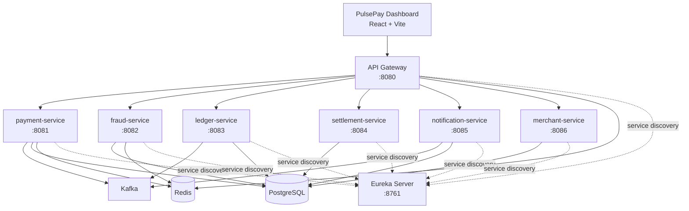

# PulsePay

Microservices-based payment platform with Spring Boot services and the PulsePay merchant dashboard.

[](https://github.com/rahul24sharma/Payment-Processing-System/actions/workflows/ci.yml)
[](https://github.com/rahul24sharma/Payment-Processing-System/actions/workflows/integration-tests.yml)

## Architecture Diagram



## Service Boundaries

| Service | Responsibility |
|---|---|
| `api-gateway` | Single entrypoint, routing, auth forwarding, cross-cutting gateway behavior |
| `payment-service` | Payment lifecycle (`create/auth/capture/refund`), Stripe integration, webhook reconciliation |
| `fraud-service` | Risk/fraud scoring and decision signals |
| `ledger-service` | Accounting entries and financial state tracking |
| `settlement-service` | Settlement/payout workflows |
| `merchant-service` | Merchant auth, profile/settings, API key management, ticketing |
| `notification-service` | Notification delivery and downstream event consumption |
| `merchant-dashboard` | Merchant-facing operations UI |

## Local Setup

### Prerequisites

- Java 21
- Maven 3.9+
- Node 20+
- PostgreSQL on `5432`
- Redis on `6379`
- Kafka on `9092` or `29092`

### 1) Configure environment

```bash
cp .env.example .env
```

Required minimum:

- `JWT_SECRET` must be at least 32-byte equivalent for HS256.
- Stripe values (`STRIPE_SECRET_KEY`, `STRIPE_WEBHOOK_SECRET`) should be test keys for local.

### 2) Start backend stack

```bash
./start-local.sh
```

### 3) Start frontend

```bash
cd merchant-dashboard
npm ci
npm run dev
```

### 4) Stop stack

```bash
./stop-local.sh
```

## CI Workflows

- `ci.yml`:
  - backend build matrix (all services)
  - backend test matrix (service-level tests)
  - frontend build (`merchant-dashboard`)
- `integration-tests.yml`:
  - infra-backed integration checks

## End-to-End Demo Flow

Use this flow for release/demo validation:

1. Register merchant and log in
2. Create payment
3. Complete auth / capture
4. Create refund
5. Trigger webhook and verify status sync
6. Create/update ticket and verify timeline

Full checklist: `docs/e2e-reliability-checklist.md`

## Demo Screenshots / GIF

Store and reference demo artifacts under `docs/demo/`:

- `docs/demo/dashboard.png`
- `docs/demo/create-payment.png`
- `docs/demo/payment-lifecycle.gif`
- `docs/demo/refund-flow.png`
- `docs/demo/webhook-events.png`

See `docs/demo/README.md` for exact capture checklist.

## Security / Compliance Clarity

### Production-ready in this repo

- Env-backed secret configuration (no required hardcoded credentials)
- JWT auth + role checks foundation
- Stripe webhook signature verification
- Idempotency controls in payment/webhook paths
- Sensitive bank-account field encryption + masking
- Key versioning support + re-encryption maintenance endpoint

### Not production-complete yet

- Managed KMS/HSM custody and automated key rotation orchestration
- Full SOC2/PCI evidence program and control attestations
- Complete RBAC verification matrix across every admin endpoint/UI action
- Full audit-log coverage validation for all sensitive operations
- Operational SLO/alert maturity for all services and event pipelines

### Runbooks / Policies

- Key rotation + re-encryption runbook: `docs/security-compliance-pass.md`
- Env-only secret policy: `docs/security-compliance-pass.md`
- Reliability and incident checks: `docs/operations-runbook.md`

## RBAC / Audit Scope (Current)

- RBAC is implemented at core auth/role levels and applied on key protected actions.
- Audit logging hooks exist for sensitive flows.
- Remaining hardening work is scope-completeness verification:
  - ensure every admin-only endpoint is explicitly role-gated
  - ensure every sensitive write action emits an auditable trail

For detailed status and remaining gaps, use `docs/security-compliance-pass.md`.
